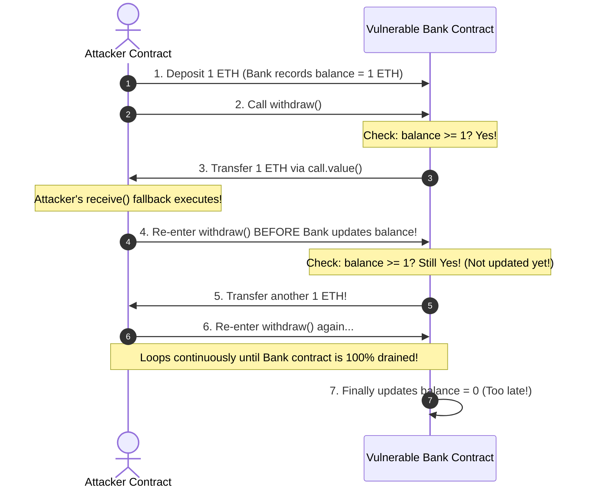
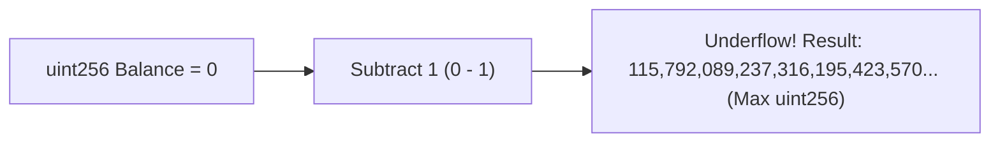
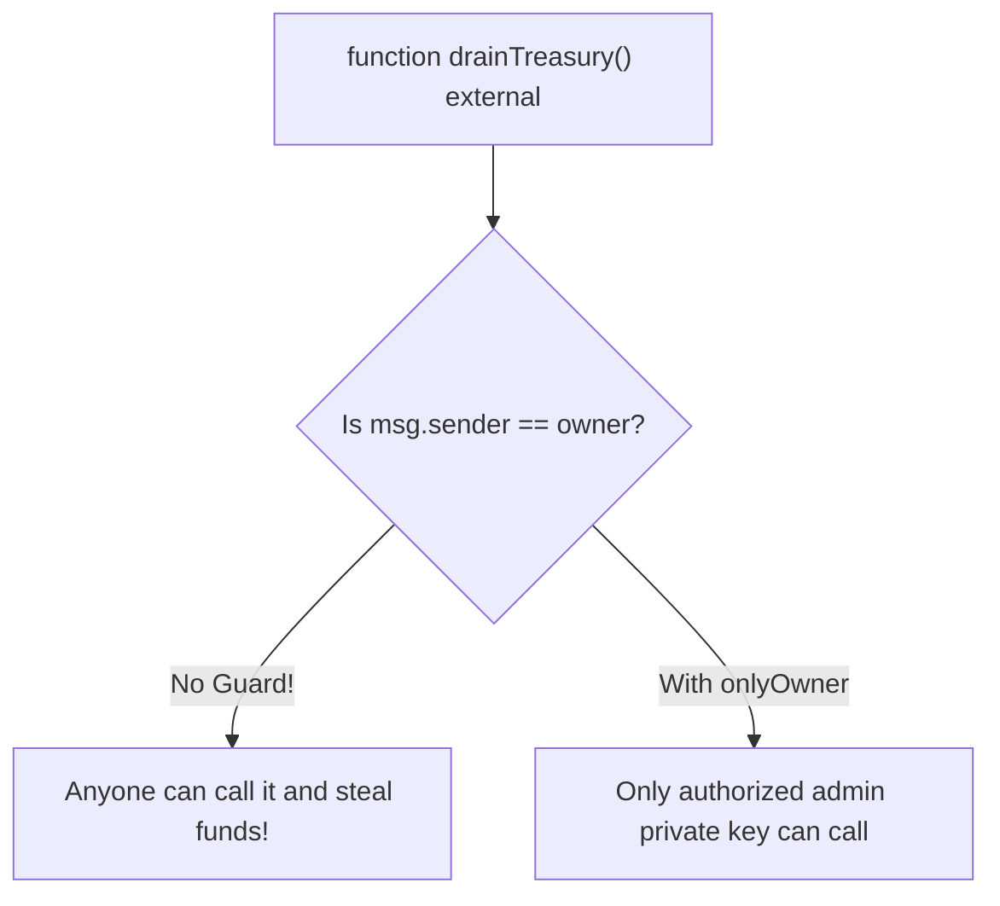
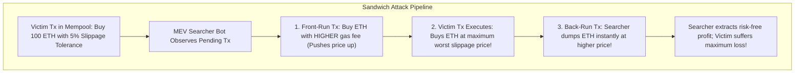
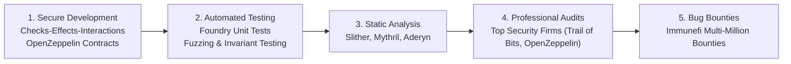

# Smart Contract Security and Common Vulnerabilities

In traditional web development, software engineering is guided by the Silicon Valley philosophy: *"Move fast and break things."*
If a web application has a critical bug, an engineer logs into an AWS server, patches the source code, pushes a hotfix via Git, and restarts the web server within ten minutes.
If a database record is corrupted, an administrator restores yesterday's SQL backup.

In smart contract engineering, this philosophy is disastrous.
Smart contracts operate under a completely different paradigm:
- **Immutability:** Once code is deployed to a public blockchain, it cannot be edited, patched, or stopped.
- **Direct Financial Custody:** Smart contracts do not manage abstract data records; they hold billions of dollars of bearer financial assets directly in their storage variables.
- **Open Adversarial Environment:** The bytecode of every smart contract and every transaction in the mempool is publicly readable by anyone on Earth, including thousands of sophisticated, automated exploit bots and adversarial hackers searching for flaws 24/7.

A single arithmetic flaw, an uninitialized variable, or an incorrect ordering of state updates can result in the instantaneous, irreversible loss of hundreds of millions of dollars.
Security is the supreme prerequisite of blockchain engineering.

## The Reentrancy Vulnerability

The most famous vulnerability in blockchain history is **Reentrancy**.
It was the exploit mechanism that drained the original **The DAO** in June 2016, resulting in the theft of 3.6 million ETH and causing the historic hard fork that split Ethereum from Ethereum Classic.

### What is Reentrancy?

Reentrancy occurs when a contract transfers Ether (or invokes an external call) to an untrusted recipient **before** it updates its internal state records (such as decrementing the user's balance).



### The Vulnerable Code Pattern

Consider this naive bank contract:

```solidity
// VULNERABLE CONTRACT: DO NOT USE
contract VulnerableBank {
    mapping(address => uint256) public balances;

    function deposit() external payable {
        balances[msg.sender] += msg.value;
    }

    function withdraw() external {
        uint256 amount = balances[msg.sender];
        require(amount > 0, "No funds");

        // FLAW: External call made BEFORE balance is updated!
        (bool success, ) = msg.sender.call{value: amount}("");
        require(success, "Transfer failed");

        balances[msg.sender] = 0; // State update occurs too late!
    }
}
```

### How the Attacker Exploits It:

1. The attacker deploys an `Attacker` contract and deposits 1 ETH into `VulnerableBank`.
2. The attacker calls `withdraw()`.
3. `VulnerableBank` checks that the attacker has 1 ETH, and uses `msg.sender.call{value: amount}("")` to send the Ether.
4. When Ether is transferred to a smart contract, it automatically triggers the recipient's **`receive()` or `fallback()` function**.
5. Inside its `receive()` function, the attacker contract immediately calls `VulnerableBank.withdraw()` **a second time!**
6. Because `VulnerableBank` has not yet executed `balances[msg.sender] = 0`, the balance check passes again.
7. The bank sends another 1 ETH to the attacker, triggering the fallback loop again.
8. This recursive cycle continues until the bank contract's entire treasury is completely emptied!

### The Defense: Checks-Effects-Interactions and Mutex Locks

#### 1. The Checks-Effects-Interactions (CEI) Pattern:
Always update internal state variables *before* interacting with external contracts:

```solidity
function withdraw() external {
    // 1. CHECKS
    uint256 amount = balances[msg.sender];
    require(amount > 0, "No funds");

    // 2. EFFECTS (Update state FIRST!)
    balances[msg.sender] = 0;

    // 3. INTERACTIONS (External calls LAST!)
    (bool success, ) = msg.sender.call{value: amount}("");
    require(success, "Transfer failed");
}
```

#### 2. ReentrancyGuard (Mutex Locks):
Use OpenZeppelin's `nonReentrant` modifier, which sets a persistent storage flag during execution:

```solidity
import "@openzeppelin/contracts/security/ReentrancyGuard.sol";

contract SecureBank is ReentrancyGuard {
    function withdraw() external nonReentrant {
        // Safe from reentrancy
    }
}
```

## Arithmetic Overflows and Underflows

In programming, unsigned integers (`uint8`, `uint256`) have fixed bit sizes.
If an arithmetic calculation exceeds the maximum boundary or drops below zero:
- **Overflow:** $255 + 1 \to 0$ (in `uint8`)
- **Underflow:** $0 - 1 \to 2^{256} - 1 \approx 1.15 \times 10^{77}$ (in `uint256`)



Prior to Solidity version 0.8.0, arithmetic did not revert on overflow or underflow by default.
An attacker who transferred 1 token from an empty account could trigger an underflow, giving themselves a balance of $1.15 \times 10^{77}$ tokens!

### The Modern Fix:

- In modern Solidity ($\ge \mathtt{0.8.0}$), the compiler automatically injects runtime overflow/underflow checks that revert the transaction on arithmetic error.
- If developers explicitly need unconstrained arithmetic (for gas optimizations), they must wrap the calculation inside an `unchecked { ... }` block.

## Access Control Flaws and Unprotected Initialization

Access control vulnerabilities occur when critical administrative functions (such as minting tokens, pausing contracts, or withdrawing treasury funds) are left unprotected by proper cryptographic guards.



### The Parity Multisig Freeze ($150 Million - November 2017)

One of the most catastrophic access control incidents occurred in the **Parity Multi-Sig Wallet library**:
- Parity's multi-sig wallets used an external library contract (`WalletLibrary.sol`) to hold their core logic.
- The library contract contained an initialization function:
  ```solidity
  function initWallet(address[] _owners, uint _required) {
      initMultiowned(_owners, _required);
  }
  ```
- **The Fatal Flaw:** The function had no visibility modifier or access restriction! Anyone could call it.
- A developer accidentally called `initWallet()` on the shared library contract directly, making themselves the sole owner of the library contract.
- The user then called `kill()` (`SELFDESTRUCT`) on the library.
- The library contract was permanently erased from the Ethereum state machine.
- As a result, **513 multi-sig wallets holding 587,000 ETH (worth over $150 million at the time and billions today)** became permanently frozen forever, because their underlying execution logic no longer existed on-chain!

## Front-Running and Maximum Extractable Value (MEV)

Because transactions sit in the public mempool before being included in a block, anyone running a full node can inspect pending transactions in real time.
Sophisticated actors running high-frequency algorithms (called **Searchers**) exploit this transparency to extract **Maximum Extractable Value (MEV)**.



### The Sandwich Attack Walkthrough:

1. **Detection:** A searcher bot detects Alice's transaction in the public mempool: Alice is swapping $500,000 USDC for ETH on Uniswap with a $3\%$ slippage tolerance.
2. **Front-Run:** The bot constructs a transaction to buy ETH ahead of Alice.
   The bot broadcasts this transaction with a higher priority fee (`maxPriorityFeePerGas`), ensuring validators mine it *before* Alice's trade.
   This purchase pushes up the price of ETH on the AMM curve.
3. **Victim Execution:** Alice's transaction executes at the top of her allowable slippage band, buying ETH at the artificially inflated price and pushing the price even higher.
4. **Back-Run:** In the very next transaction of the block, the bot sells its ETH back into the pool at the peak price.
5. **Result:** The bot pockets thousands of dollars in guaranteed arbitrage profit, while Alice receives significantly less ETH than she expected.

### MEV Mitigations:

- **Private RPC Endpoints (Flashbots Protect, MEV-Blocker):** Users route transactions through private relays directly to block builders, bypassing the public mempool entirely so searchers cannot see them.
- **Batch Auctions (CoW Protocol):** Transactions are matched off-chain in batch auctions with a single uniform clearing price, eliminating transaction ordering dependencies.

## Comprehensive Smart Contract Security Lifecycle

Building production smart contracts requires a defense-in-depth engineering culture:



1. **Strict Unit and Invariant Fuzzing:** Using frameworks like **Foundry**, developers write property-based tests that generate millions of randomized inputs to discover edge cases.
2. **Static Analysis:** Automated tools (Slither, Aderyn) scan AST parse trees for known vulnerability signatures (reentrancy, uninitialized state, shadow variables).
3. **Formal Verification:** Using mathematical solvers (Certora, Halmos) to prove mathematically that a contract satisfies specific invariants under all possible states.
4. **Multiple Independent Audits:** Engaging specialized security research firms to manually review the codebase line by line.
5. **Bug Bounties (Immunefi):** Offering multi-million dollar rewards for white-hat hackers who discover and report vulnerabilities responsibly before malicious actors can exploit them on mainnet.
