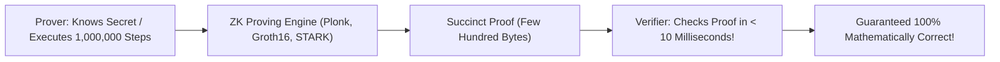
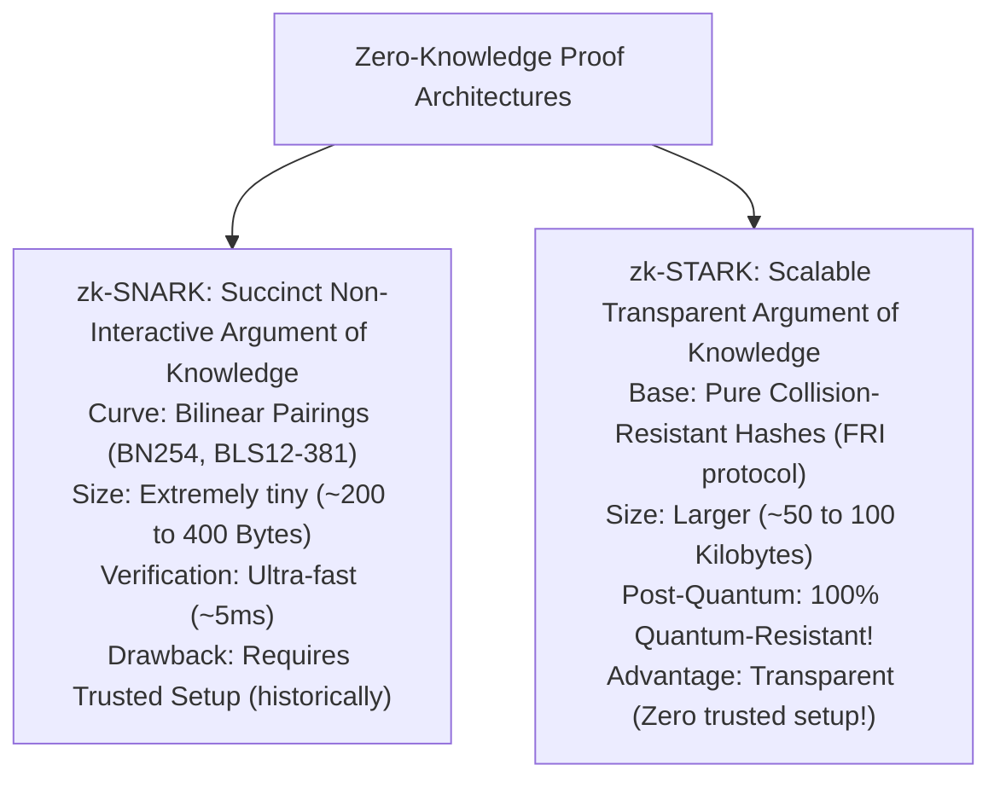
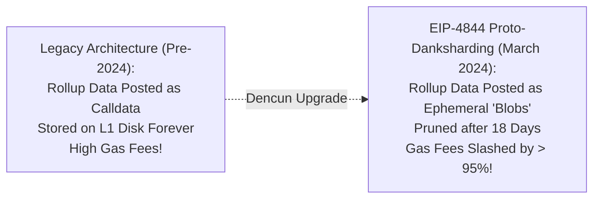
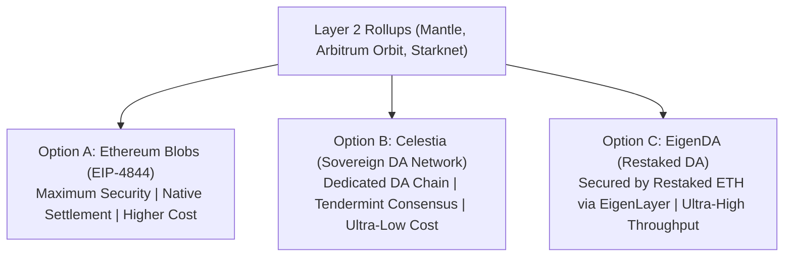
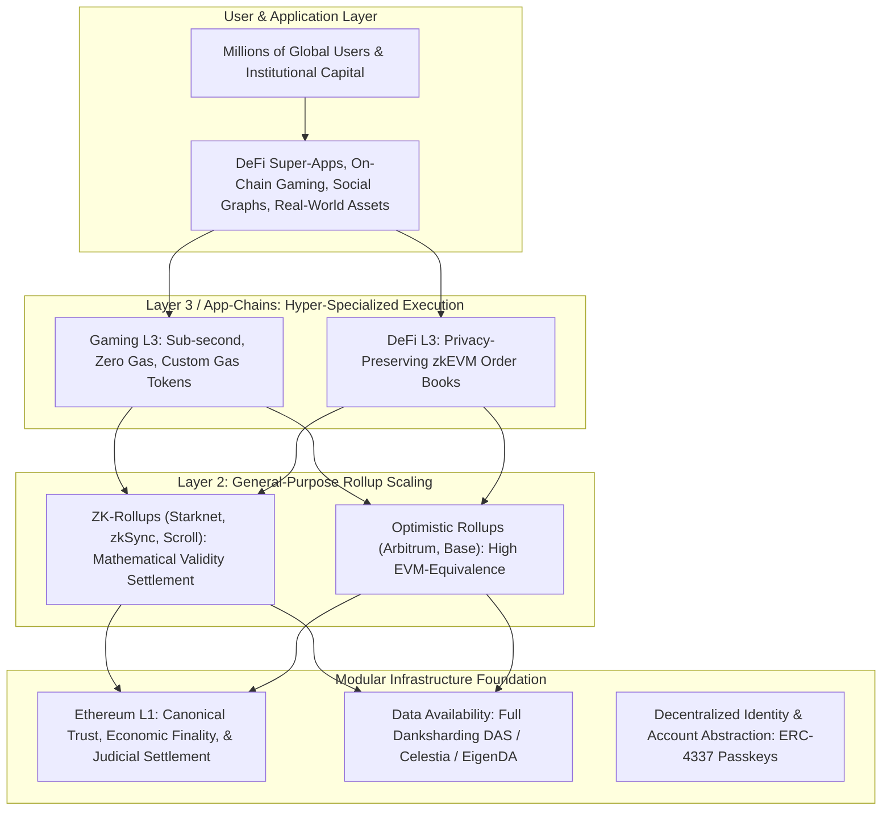

# The Frontier: Zero-Knowledge Proofs and Modular Future

Over the course of this foundational track, we have explored the evolution of decentralized trust:
From the double-spending problem and cryptographic hash functions, to Nakamoto consensus and Proof of Stake, to the Ethereum Virtual Machine, decentralized finance, and Layer 2 scaling.

The culmination of these technological breakthroughs converges at the modern frontier of distributed systems:
1. **Zero-Knowledge Proofs (ZKPs):** Cryptographic engines that enable privacy and universal scalability.
2. **Data Availability (DA) and Danksharding:** The engineering solution to the blockchain data throughput bottleneck.
3. **The Modular Endgame:** The future architecture where decentralized networks achieve global scale without compromising self-sovereignty.

## Zero-Knowledge Proofs: Magic Cryptography

In traditional computing, proving that you computed something correctly requires the verifier to replay the entire computation step by step.
If a program takes three hours to run, the verifier must spend three hours re-running it.

**Zero-Knowledge Proofs (ZKPs)** break this fundamental law of computing:

> A Zero-Knowledge Proof allows a Prover to mathematically convince a Verifier that a specific statement is true, without revealing any secret information beyond the validity of the statement itself, and allowing the Verifier to check the proof in milliseconds regardless of how long the original computation took.

### The Three Invariant Properties of a ZKP:

1. **Completeness:** If the statement is true and the prover is honest, the verifier will always be convinced.
2. **Soundness:** If the statement is false, it is mathematically impossible for a cheating prover to convince the verifier (except with an astronomically tiny probability, e.g. $2^{-128}$).
3. **Zero-Knowledge:** The verifier learns nothing about the secret inputs (witness) used to generate the proof.

### The Two Revolutions Enabled by ZKPs:

- **Privacy (Shielded Transactions):** In systems like **Zcash** or **Tornado Cash**, a user can prove they own valid unspent funds and are authorized to spend them, **without revealing their wallet address, the recipient address, or the transaction amount**.
- **Scalability (Succinct Verification):** In **ZK-Rollups**, a prover executes 50,000 transactions off-chain and generates a compact 300-byte proof.
  Ethereum Layer 1 verifies the proof in 250,000 gas, settling 50,000 transactions instantly without having to execute a single one of them on Layer 1!

## SNARKs vs. STARKs: The Cryptographic Landscape

The two dominant families of Zero-Knowledge proofs are **SNARKs** and **STARKs**:

### 1. zk-SNARKs (Succinct Non-Interactive Arguments of Knowledge)

- **Pros:** Proofs are exceptionally compact (200 to 400 bytes) and consume very little gas to verify on the EVM.
- **The Trusted Setup Challenge:** Classical SNARKs (like Groth16) require an initial "Ceremony" to generate toxic cryptographic waste parameters.
  If the ceremony participants colluded, they could forge proofs and mint infinite coins undetected.
  Modern universal SNARKs (like PLONK) eliminated per-circuit ceremonies, but still require structured reference strings.

### 2. zk-STARKs (Scalable Transparent Arguments of Knowledge)

Pioneered by Eli Ben-Sasson and the StarkWare team:
- **Transparent (Zero Trusted Setup):** Relies strictly on collision-resistant cryptographic hash functions (such as SHA-256 or Poseidon) and Fast Reed-Solomon Interactive Oracle Proofs of Proximity (FRI). No toxic waste or trusted setups are ever required.
- **Post-Quantum Security:** Because STARKs do not use elliptic curves or discrete logarithms, **they are immune to attacks by future quantum computers**.
- **Trade-off:** STARK proofs are significantly larger (tens of kilobytes), requiring higher on-chain calldata bandwidth.

## The Data Availability Problem and EIP-4844 (Proto-Danksharding)

In modern Layer 2 scaling, execution has been moved off-chain.
However, Layer 2 rollups still face a massive physical bottleneck on Layer 1: **Data Availability (DA)**.

For a rollup to be secure, everyone must be able to download the raw transaction data to verify state roots or construct fraud proofs.
Historically, rollups posted this data to Ethereum Layer 1 as **Calldata**:
- Calldata is stored permanently in the Ethereum state history.
- Calldata competes directly with standard DeFi transactions for gas.
- When Ethereum gas fees spiked, rollup transaction fees spiked alongside them!

### EIP-4844 Proto-Danksharding (March 2024)

In March 2024, Ethereum activated the **Dencun Hard Fork**, introducing **EIP-4844 (Proto-Danksharding)**:
- Introduces a completely new transaction type: **Blob-Carrying Transactions**.
- Each block can carry up to **6 data blobs** (each blob is 128 kilobytes of raw binary data, adding ~768 KB of data capacity per block).
- **Ephemeral Storage:** Blobs are **not** accessible to the EVM execution engine and are **not stored permanently on disk**.
  Ethereum consensus nodes store blobs for only **18 days** (ample time for any challenger to download the data and construct a fraud proof) before permanently pruning them from SSDs.
- **Dedicated Blob Fee Market:** Blobs have their own independent EIP-1559 dynamic fee market.
  When the Dencun upgrade went live, rollup transaction fees on Arbitrum, Optimism, and Base instantly dropped from $\$0.50$ down to **less than $\$0.01$**, delivering true consumer-scale transaction costs.

### Full Danksharding and Data Availability Sampling (DAS)

The ultimate vision for Ethereum is **Full Danksharding**:
- Expanding blob capacity from 6 blobs to **64+ blobs per block** (~16 megabytes per block).
- How can consumer laptop validators verify 16 megabytes of data every 12 seconds without saturating their home internet connections?
- Through **Data Availability Sampling (DAS)**:
  Using polynomial commitments (KZG commitments) and Reed-Solomon erasure coding, nodes do not download the full 16 megabytes.
  A node randomly samples a few dozen tiny 1-kilobyte chunks of the block over the network.
  If the sampled chunks are available, the node mathematically proves that **100 percent of the entire 16 MB dataset is available to the public**, achieving massive data throughput with consumer hardware.

## The Specialized DA Ecosystem: Celestia and EigenDA

Beyond Ethereum's native roadmap, specialized **Modular Data Availability Layers** emerged:

- **Celestia:** A purpose-built, bare-bones blockchain that does zero smart contract execution.
  Its sole purpose is ordering transactions and providing 2D Reed-Solomon Data Availability Sampling, acting as an ultra-cheap, hyperscalable data availability foundation for rollups.
- **EigenDA:** A data availability service secured by billions of dollars of **restaked Ethereum (ETH)** via the **EigenLayer** protocol, delivering high-throughput data bandwidth directly to Ethereum-aligned rollups.

## The Modular Endgame Architecture

As the blockchain technology stack matures, the future of decentralized infrastructure crystallizes into a **Specialized Modular Matrix**:

### The Architectural Triumphs of the Modular Endgame:

1. **Scalability Without Centralization:** Millions of transactions execute across hundreds of Layer 2 rollups and Layer 3 appchains, while the foundational base layer remains lightweight, decentralized, and verifiable on consumer laptops.
2. **Deterministic Cryptographic Security:** Mathematical validity proofs (ZK-STARKs) replace empirical human trust with unforgeable algebraic laws.
3. **Frictionless Consumer Experience:** Account abstraction (ERC-4337) with biometric passkeys, gas sponsorship, and instant intent-based bridges eliminate seed phrases and cryptographic friction for mainstream users.

You have completed the foundational blockchain engineering track.
You now possess the first-principles understanding of cryptography, consensus game theory, virtual machine mechanics, state architecture, and modular scalability required to architect, build, and secure the next generation of decentralized systems.
