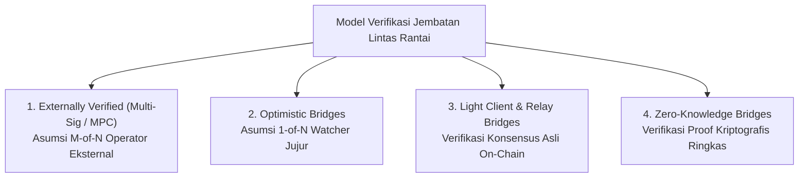

# Interoperability and Cross-Chain Bridges
Modul Presentasi: Scalability and Security (06.4)

---

## Slide 1: Judul Presentasi

### Konten Slide
- **Topik:** Interoperability and Cross-Chain Bridges: Menghubungkan Ekosistem Terfragmentasi
- **Track:** Fundamentals of Distributed Trust
- **Fokus Utama:** Membedah arsitektur verifikasi jembatan lintas rantai, risiko sistemik aset representasi (wrapped assets), dan analisis teknis di balik peretasan terbesar dalam sejarah Web3.
- *Visual:* Ilustrasi jembatan jaringan digital yang mentransfer data dan modal antara dua blockchain berdaulat yang terpisah.

### Catatan Presenter (Cheatsheet)
**Quick Cues:**
- Selamat datang di modul keempat: Interoperability and Cross-Chain Bridges.
- Membahas bagaimana menghubungkan rantai-rantai yang terfragmentasi.
- Menyoroti kenyataan bahwa jembatan lintas rantai adalah komponen paling rentan dan paling sering dieksploitasi di dunia blockchain.

**Naskah Tutur (Voiceover Script):**
Selamat datang di modul keempat dari bab Scalability and Security.
Di modul sebelumnya, kita sudah melihat bagaimana kemunculan berbagai Layer 2 dan Layer 1 independen berhasil memperluas kapasitas transaksi industri kita.
Namun, keberhasilan tersebut melahirkan masalah baru berupa fragmentasi likuiditas.
Ketika modal pengguna dan aplikasi terpecah ke dalam berbagai jaringan yang terisolasi, kita membutuhkan jembatan penghubung yang disebut Cross-Chain Bridges.
Jembatan ini memungkinkan pengguna memindahkan aset dan mengirim instruksi lintas blockchain.
Namun menghubungkan dua sistem konsensus yang berdaulat adalah salah satu tugas rekayasa paling berbahaya dalam ilmu komputer.
Bukan tanpa alasan jika smart contract jembatan menjadi target serangan peretas paling menggiurkan, dengan total kerugian mencapai miliaran dolar.
Hari ini kita akan membongkar cara kerja jembatan lintas rantai, model-model verifikasinya, dan anatomi fatal di balik eksploitasi terbesarnya.

---

## Slide 2: Masalah Isolasi Konsensus (Sovereign State Machines)

### Konten Slide
- **Sifat Alami Blockchain Publik:** Merupakan mesin status tertutup yang berdaulat dan terisolasi (*sovereign isolated state machines*).
- **Hambatan Komunikasi Asli (Native Blindness):**
  - Mesin virtual Ethereum tidak memiliki akses memori atau kapabilitas untuk membaca status internal jaringan Solana.
  - Bitcoin tidak memiliki cara bawaan untuk memverifikasi apakah sebuah pembayaran telah terjadi di Avalanche.
- **Ketiadaan Pengadilan Bersama:**
  - Masing-masing jaringan beroperasi dengan aturan kriptografi, format transaksi, dan mesin konsensus independen.
  - Tidak ada otoritas penengah alami yang dapat membatalkan transaksi di Rantai B jika terjadi kesalahan di Rantai A.
- *Visual:* Dua benteng blockchain independen (Ethereum dan Solana) dengan dinding tebal tanpa pintu tembus langsung.

### Catatan Presenter (Cheatsheet)
**Quick Cues:**
- Mengapa blockchain tidak bisa langsung saling bicara secara alami.
- Setiap blockchain didesain sebagai sistem tertutup yang hanya percaya pada aturan konsensusnya sendiri.
- Menghubungkan keduanya membutuhkan pihak ketiga atau lapisan pembuktian khusus.

**Naskah Tutur (Voiceover Script):**
Untuk memahami mengapa bridging itu sulit, kita harus melihat bagaimana blockchain dirancang dari prinsip pertama.
Secara arsitektur, setiap blockchain publik adalah mesin komputer yang berdaulat, terisolasi, dan sepenuhnya buta terhadap dunia luar.
Ethereum dirancang untuk hanya mempercayai transaksi yang ditandatangani dan diverifikasi oleh para validatornya sendiri.
Ethereum tidak punya organ sensorik untuk memeriksa apa yang sedang terjadi di Solana, begitu juga Bitcoin tidak tahu apa yang terjadi di Avalanche.
Masing-masing rantai hidup di dunianya sendiri dengan aturan kriptografi, format blok, dan mekanisme konsensus yang tidak saling kompatibel.
Tidak ada jam global bersama dan tidak ada ruang sidang bersama.
Jika kalian ingin memindahkan aset dari Rantai A ke Rantai B, kalian tidak bisa sekadar mentransfernya secara langsung.
Kalian wajib membangun sebuah mekanisme yang dapat membuktikan ke Rantai B bahwa sesuatu yang sah telah benar-benar terjadi di Rantai A.

---

## Slide 3: Anatomi Alur Kerja Cross-Chain Bridge

### Konten Slide
- **Empat Fase Perpindahan Nilai Lintas Rantai:**
  - **1. Lock / Burn di Rantai Asal (Chain A):** Pengguna (Alice) menyetorkan dan mengunci 10 ETH ke dalam smart contract brankas jembatan (*bridge escrow vault*).
  - **2. Event Emission:** Kontrak pintar di Chain A memancarkan log peristiwa (*event log*) yang memuat detail setoran, penerima, dan rantai tujuan.
  - **3. Relay & Verification:** Entitas perantara (relayer atau komite verifikator) mendeteksi peristiwa tersebut dan memverifikasi keabsahannya.
  - **4. Mint / Unlock di Rantai Tujuan (Chain B):** Setelah verifikasi diterima, kontrak jembatan di Chain B mencetak token representasi (10 wETH) atau melepaskan likuiditas lokal ke dompet Alice.
- *Visual:* Sequence diagram alur 4 tahap: Alice -> Lock di Chain A -> Event Log -> Bridging Verification Mechanism -> Mint di Chain B -> Alice menerima token.

### Catatan Presenter (Cheatsheet)
**Quick Cues:**
- Alur baku bridging: Lock di asal, verifikasi di tengah, rilis di tujuan.
- Token fisik tidak pernah benar-benar terbang melintasi internet; yang berpindah adalah hak kepemilikan representasi.
- Titik paling kritis dan rawan serangan berada pada mekanisme verifikasi di tahap ketiga.

**Naskah Tutur (Voiceover Script):**
Banyak pengguna mengira bahwa saat mereka melakukan bridging, koin mereka terbang secara fisik melintasi internet dari satu rantai ke rantai lain.
Kenyataannya tidak demikian.
Koin asli kalian tidak pernah meninggalkan blockchain asalnya.
Proses bridging bekerja melalui empat tahapan terstruktur.
Tahap pertama: Alice menyetorkan 10 ETH asli miliknya ke sebuah brankas kontrak pintar di Ethereum.
Tahap kedua: kontrak brankas tersebut menerbitkan sebuah pengumuman atau event log yang menyatakan bahwa 10 ETH telah resmi dikunci untuk Alice.
Tahap ketiga: sebuah mekanisme verifikasi jembatan membaca pengumuman tersebut dan memvalidasi keabsahannya.
Tahap keempat: mekanisme verifikasi memberi tahu kontrak pintar di rantai tujuan, misalnya Avalanche, untuk mencetak 10 token representasi bernama wETH ke dompet Alice.
Token asli kalian tetap terkunci mati di brankas Ethereum sebagai jaminan atas token representasi yang beredar di Avalanche.
Dan di sinilah titik paling kritisnya: seluruh keamanan sistem ini bertumpu pada siapa dan bagaimana mekanisme verifikasi di tahap ketiga bekerja.

---

## Slide 4: Taksonomi Model Verifikasi Jembatan

### Konten Slide
- **Spektrum Asumsi Kepercayaan (Trust Spectrum):**

- **Prinsip Dasar Evaluasi:** Keamanan sebuah jembatan berbanding lurus dengan seberapa sedikit asumsi kepercayaan manusia yang dibutuhkan untuk memvalidasi pesan lintas rantai.
- *Visual:* Diagram spektrum dari yang paling bergantung pada kepercayaan manusia (Multi-Sig) hingga yang murni bersandar pada matematika (ZK Bridges).

### Catatan Presenter (Cheatsheet)
**Quick Cues:**
- Empat kelas verifikasi: Multi-Sig, Optimistic, Light Client, dan ZK.
- Semakin ke kanan, semakin minim ketergantungan pada kepercayaan manusia, namun semakin rumit rekayasa kodenya.
- Sebagian besar peretasan historis terjadi pada model paling kiri (Multi-Sig).

**Naskah Tutur (Voiceover Script):**
Untuk mengevaluasi keamanan sebuah jembatan, kita harus melihat bagaimana model verifikasinya dibangun.
Secara teknis, ada empat rumpun model verifikasi yang membentuk spektrum kepercayaan.
Rumpun pertama adalah Externally Verified Bridges, yang mengandalkan komite validator luar atau tanda tangan multi-sig.
Rumpun kedua adalah Optimistic Bridges, yang menerapkan jendela sanggahan di mana satu pengawas jujur cukup untuk menghentikan kecurangan.
Rumpun ketiga adalah Light Client Bridges, di mana smart contract di rantai tujuan memverifikasi sendiri tanda tangan konsensus rantai asal secara langsung tanpa komite luar.
Dan rumpun keempat yang paling mutakhir adalah Zero-Knowledge Bridges, yang menggunakan bukti matematika ZK untuk memverifikasi konsensus asing dengan biaya gas murah.
Mari kita telaah satu per satu risiko dan arsitektur dari keempat model ini.

---

## Slide 5: Model 1: Externally Verified Bridges (Multi-Sig & MPC)

### Konten Slide
- **Prinsip Operasional:**
  - Mempekerjakan sekelompok kecil simpul eksternal (sering kali 5 hingga 9 validator) atau federasi Multi-Party Computation (MPC).
  - Ketika mendeteksi deposit di Rantai A, komite ini menandatangani instruksi otorisasi secara kolektif untuk mencetak token di Rantai B.
- **Asumsi Kepercayaan:** Bergantung sepenuhnya pada ambang batas kejujuran $M$-of-$N$ (misalnya 4 dari 7 tanda tangan sah).
- **Kerentanan Fatal:**
  - **Single Point of Social Failure:** Penyerang tidak perlu membobol protokol blockchain yang mendasarinya; mereka hanya perlu mencuri kunci pribadi segelintir manusia pengelola server.
  - Menjadi penyebab langsung kerugian terbesar di industri: peretasan Ronin Network ($625 juta) dan Harmony Horizon ($100 juta).
- *Visual:* Diagram penyerang membobol threshold kunci privat multi-sig (5 dari 9) untuk memalsukan instruksi pencetakan dana.

### Catatan Presenter (Cheatsheet)
**Quick Cues:**
- Model paling populer karena paling mudah dan murah untuk dibangun.
- Sangat rapuh: keamanan miliaran dolar hanya dijaga oleh segelintir kunci server.
- Kasus Ronin dan Harmony membuktikan bahwa rekayasa sosial atau malware pada validator langsung meruntuhkan seluruh jembatan.

**Naskah Tutur (Voiceover Script):**
Model pertama adalah yang paling banyak digunakan di industri karena sangat mudah dan murah untuk dibangun: Externally Verified Bridges.
Alih-alih membangun logika kriptografi yang rumit, pengembang menunjuk sekelompok kecil server pihak ketiga, biasanya lima sampai sembilan entitas, untuk bertindak sebagai dewan juri.
Ketika ada pengguna yang menyetor uang di Ethereum, dewan validator ini berkumpul di luar rantai, menandatangani persetujuan, dan mengirim instruksi ke Avalanche untuk mencetak token.
Model ini bersandar pada asumsi M-of-N: selama mayoritas validator jujur, sistem aman.
Namun inilah titik kegagalan sosial yang paling mematikan.
Peretas tidak perlu repot-repot meretas algoritma kriptografi Ethereum yang bernilai ratusan miliar dolar.
Peretas cukup menargetkan komputer milik segelintir validator manusia tersebut menggunakan teknik phishing atau malware.
Begitu penyerang berhasil menguasai ambang batas kunci privat, mereka bisa menandatangani pesan palsu untuk mencetak miliaran token kosong dan menguras seluruh isi brankas jembatan.
Inilah pola yang menghancurkan Ronin Network dan Harmony Horizon.

---

## Slide 6: Model 2: Optimistic Bridges

### Konten Slide
- **Inspirasi dari Optimistic Rollups:** Menerapkan filosofi praduga tak bersalah pada transmisi pesan lintas rantai.
- **Mekanisme Kerja (contoh: Nomad):**
  - Relayer mengajukan akar pesan (*proposed message root*) ke kontrak pintar di rantai tujuan.
  - Membuka jendela waktu sanggahan (*fraud challenge window*, misalnya 30 menit).
  - Simpul pengawas independen (*watchers*) terus memantau apakah ada pesan penarikan palsu yang tidak pernah ada di rantai asal.
  - Jika pesan terdeteksi curang, watcher mengirimkan bukti kecurangan (*fraud proof*) untuk membekukan jembatan secara otomatis sebelum dana bisa dicairkan.
- **Asumsi Kepercayaan:** $1$-of-$N$ honest watcher assumption (jauh lebih aman dibanding model multi-sig).
- **Trade-off:** Mengharuskan pengguna menunggu jeda waktu sengketa (latensi 30 menit atau lebih) sebelum dana dapat digunakan di rantai tujuan.
- *Visual:* Alur transmisi pesan Optimistic Bridge yang melewati gerbang timer sanggahan 30 menit yang diawasi oleh Watcher independen.

### Catatan Presenter (Cheatsheet)
**Quick Cues:**
- Menerapkan konsep sanggahan rollup ke dalam komunikasi jembatan.
- Asumsi keamanan jauh lebih unggul daripada multi-sig: hanya butuh satu watcher jujur untuk menggagalkan pencurian.
- Konsekuensinya ada latensi waktu tunggu sebelum dana cair.

**Naskah Tutur (Voiceover Script):**
Melihat rapuhnya model multi-sig, para pengembang mencoba mengadopsi filosofi rollup ke dalam jembatan: lahirlah Optimistic Bridges, seperti protokol Nomad.
Di sistem ini, ketika relayer membawa pesan dari Rantai A ke Rantai B, pesan itu tidak langsung dicairkan seketika.
Kontrak di rantai tujuan akan menahan transaksi tersebut di dalam jendela waktu sanggahan, misalnya selama tiga puluh menit.
Di saat yang sama, ada jaringan simpul pengawas bernama watchers yang mengawasi kedua rantai secara serentak.
Jika ada pihak jahat yang mencoba menyusupkan transaksi palsu, watcher punya waktu tiga puluh menit untuk mengirim bukti kecurangan dan membekukan operasional jembatan.
Tingkat keamanannya jauh lebih baik daripada multi-sig biasa karena kita hanya butuh satu watcher jujur di seluruh dunia untuk melindungi jembatan.
Namun komprominya adalah kenyamanan pengguna.
Pengguna dipaksa menunggu jeda waktu puluhan menit sebelum token mereka bisa dicairkan di rantai tujuan.

---

## Slide 7: Model 3 & 4: Light Client Bridges dan ZK Bridges

### Konten Slide
- **Model 3: Native Light Client Bridges (Cosmos IBC, Rainbow Bridge):**
  - Kontrak pintar di Rantai B mengimplementasikan **klien ringan (light client)** penuh dari konsensus Rantai A.
  - Relayer hanya bertugas mengantarkan block header dari Rantai A ke Rantai B.
  - Kontrak di Rantai B memverifikasi secara langsung tanda tangan validator konsensus Rantai A dan memeriksa bukti Merkle transaksi.
  - *Tingkat Keamanan:* Setara dengan keamanan konsensus asli kedua rantai tanpa ada komite perantara.
- **Kendala Utama Light Client Tradisional:**
  - Sangat boros gas pada rantai seperti Ethereum, karena memverifikasi ratusan tanda tangan validator asing per blok dapat melampaui batas gas blok L1.
- **Model 4: Zero-Knowledge (ZK) Bridges:**
  - Mengatasi beban komputasi on-chain dengan memindahkan verifikasi tanda tangan validator ke sirkuit ZK off-chain.
  - Kontrak pintar di Rantai B hanya memverifikasi satu bukti ZK-SNARK ringkas ($\approx 250.000$ gas) yang membuktikan bahwa blok asing telah ditandatangani secara sah oleh mayoritas validator.
- *Visual:* Perbandingan verifikasi ratusan tanda tangan on-chain yang mahal vs verifikasi satu bukti ZK-SNARK yang ringkas di smart contract.

### Catatan Presenter (Cheatsheet)
**Quick Cues:**
- Light client adalah standar emas desentralisasi (IBC di ekosistem Cosmos).
- Kendala di Ethereum: biaya gas untuk memverifikasi signature rantai lain sangat mahal.
- ZK Bridges menyelesaikan masalah biaya tersebut: verifikasi ribuan signature di luar rantai, buktikan keabsahannya dengan satu bukti ZK di L1.

**Naskah Tutur (Voiceover Script):**
Standar emas teoretis untuk jembatan lintas rantai sebenarnya adalah Light Client Bridges, yang diimplementasikan secara sempurna pada protokol IBC di ekosistem Cosmos.
Di model ini, sebuah smart contract di Rantai B benar-benar bertindak sebagai node verifikator bagi Rantai A.
Relayer hanya mengantar header blok dari Rantai A, lalu smart contract di Rantai B akan memeriksa tanda tangan para validator asli rantai tersebut secara langsung.
Tidak ada komite multi-sig, tidak ada pihak ketiga yang harus dipercaya.
Keamanannya sama persis dengan keamanan konsensus blockchain itu sendiri.
Namun, ada masalah biaya yang sangat besar jika kita menerapkannya di Ethereum.
Memeriksa ratusan tanda tangan kriptografis dari rantai lain di dalam mesin virtual Ethereum memakan jutaan biaya gas yang mustahil dibayar oleh pengguna biasa.
Di sinilah ZK Bridges hadir sebagai penyelamat.
Alih-alih memeriksa ratusan tanda tangan satu per satu di smart contract, komputer off-chain memverifikasi tanda tangan tersebut di dalam sirkuit Zero-Knowledge, lalu mengirimkan satu bukti ZK ringkas ke Ethereum.
Smart contract cukup memverifikasi satu bukti kecil itu dengan biaya gas yang sangat murah.

---

## Slide 8: Mekanisme Transfer Nilai: Lock-and-Mint dan Risiko Depeg

### Konten Slide
- **Mekanisme Lock-and-Mint (Wrapped Assets):**
  - Alice mengunci 100 ETH asli di brankas jembatan Ethereum.
  - Smart contract jembatan di Solana mencetak 100 token representasi sintetis (`wETH`).
- **Risiko Sistemik Kontra-Pihak (Counterparty Risk):**
  - Nilai ekonomi `wETH` di Solana hanya ada karena adanya jaminan 100 ETH asli yang terkunci di Ethereum.
  - Jika brankas penyimpanan di Ethereum diretas atau dibobol, token representasi `wETH` di Solana seketika kehilangan 100 persen nilai jaminan dasarnya.
- **Efek Domino Keruntuhan Likuiditas (Depeg Death Spiral):**
  - Token sintetis terdepeg ke nol, melumpuhkan protokol pinjaman (*lending pools*) dan kolam AMM di seluruh ekosistem tujuan yang menerima aset tersebut sebagai jaminan.
- *Visual:* Diagram brankas asal dibobol penyerang -> Token representasi di rantai tujuan mendadak tidak bernilai dan mengalami depeg tajam ke nol.

### Catatan Presenter (Cheatsheet)
**Quick Cues:**
- Lock-and-Mint menciptakan wrapped assets (seperti wETH atau soETH).
- Nilai token representasi sepenuhnya bergantung pada keamanan brankas di rantai asal.
- Jika brankas asal kosong, token representasi di rantai tujuan berubah menjadi kertas kosong tak berharga.

**Naskah Tutur (Voiceover Script):**
Sekarang mari kita telusuri bagaimana aset berpindah secara ekonomi.
Mekanisme yang paling umum digunakan adalah Lock-and-Mint, yang menghasilkan wrapped assets.
Ketika Alice mengunci 100 ETH di Ethereum, jembatan mencetak 100 token sintetis wETH di rantai tujuan seperti Solana atau Avalanche.
Masalah fundamental dari model ini adalah risiko sistemik yang sangat mengerikan.
Token wETH yang beredar di Solana itu hanya punya nilai selama brankas asli di Ethereum aman dan utuh.
Jika brankas jembatan di Ethereum dibobol oleh peretas dan 100 ETH aslinya dicuri, maka 100 wETH yang ada di tangan pengguna di Solana seketika menjadi uang palsu yang tidak ada jaminannya sama sekali.
Harganya akan hancur menuju nol.
Jika token representasi ini sudah terlanjur digunakan sebagai agunan di berbagai protokol peminjaman DeFi di Solana, seluruh sistem keuangan di rantai tujuan tersebut bisa mengalami kebangkrutan berantai dalam sekejap.

---

## Slide 9: Mekanisme Alternatif: Burn-and-Mint & Liquidity Networks

### Konten Slide
- **1. Burn-and-Mint (Native Minting):**
  - *Contoh:* Circle Cross-Chain Transfer Protocol (CCTP) untuk USDC.
  - *Alur:* Token USDC asli **dibakar (*burned*)** secara permanen di Rantai A, dan penerbit resmi **mencetak (*mint*)** token USDC asli baru langsung di Rantai B.
  - *Keunggulan:* Menghilangkan keberadaan wrapped assets dan risiko depeg; pengguna selalu memegang aset asli berlisensi.
- **2. Cross-Chain Liquidity Networks (Across, Stargate):**
  - *Mekanisme:* Penyedia likuiditas independen (*liquidity providers*) menempatkan kolam cadangan aset asli di kedua sisi rantai.
  - Saat Alice menyetor USDC di Arbitrum, market maker off-chain langsung mencairkan USDC asli dari cadangan lokal di Optimism ke dompet Alice dalam hitungan detik.
  - Market maker kemudian menyeimbangkan kembali (*rebalancing*) modal mereka melalui lapisan penyelesaian yang lambat namun aman.
  - *Keunggulan:* Pengguna menerima aset asli instan tanpa risiko brankas terpusat yang rentan terkuras habis.
- *Visual:* Perbandingan diagram alur Burn-and-Mint (Bakar dan Cetak Asli) vs Liquidity Pool Network (Pertukaran Saldo Kas Lokal).

### Catatan Presenter (Cheatsheet)
**Quick Cues:**
- Dua alternatif modern untuk menghindari bahaya wrapped assets.
- Burn-and-Mint: bakar koin asli di rantai asal, cetak koin asli di rantai tujuan (contoh Circle CCTP).
- Liquidity Networks: manfaatkan market maker lokal untuk mencairkan dana instan bagi pengguna.

**Naskah Tutur (Voiceover Script):**
Untuk menghindari mimpi buruk wrapped asset, industri mengembangkan dua inovasi baru.
Pendekatan pertama adalah Burn-and-Mint untuk aset asli, seperti protokol CCTP milik Circle untuk token USDC.
Ketika kalian mentransfer USDC dari Arbitrum ke Optimism, USDC kalian di Arbitrum benar-benar dibakar hingga musnah dari peredaran.
Lalu kontrak resmi Circle di Optimism mencetak USDC baru yang asli untuk kalian.
Tidak ada token representasi sintetis, tidak ada brankas yang bisa dibobol, dan risiko depeg lenyap sepenuhnya.
Pendekatan kedua adalah Cross-Chain Liquidity Networks, seperti protokol Across.
Model ini tidak mencetak token baru sama sekali.
Mereka mengandalkan para penyedia likuiditas lokal yang menaruh modal di kedua sisi rantai.
Saat Alice menyetor koin di Arbitrum, seorang market maker lokal langsung meminjamkan koin aslinya dari kas di Optimism ke dompet Alice dalam hitungan detik.
Nantinya, sang market maker akan menyelesaikan perhitungan utang piutang antar-rantai secara santai di belakang layar.
Pengguna langsung mendapatkan koin asli dan aman dari risiko peretasan brankas raksasa.

---

## Slide 10: Kuburan Jembatan: Analisis Kasus Eksploitasi Terbesar

### Konten Slide
- **Catatan Sejarah Kerentanan Bridge Paling Berdarah:**

| Insiden Peretasan | Total Kerugian | Akar Penyebab Kerentanan Teknis |
| :--- | :--- | :--- |
| **Ronin Network (2022)** | **$625 Juta** | *Key Compromise:* Peretas mencuri 5 dari 9 private keys validator multi-sig lewat serangan spear-phishing karyawan. |
| **Wormhole Bridge (2022)** | **$320 Juta** | *Smart Contract Logic Bypass:* Peretas memalsukan instruksi sysvar di Solana untuk melewati verifikasi tanda tangan Guardian. |
| **Nomad Bridge (2022)** | **$190 Juta** | *Uninitialized Storage Pointer:* Pembaruan kontrak menyetel akar pesan tepercaya ke `0x00`, membuat semua pesan otomatis lolos verifikasi. |
| **Harmony Horizon (2022)** | **$100 Juta** | *Infrastructure Breach:* Kompromi infrastruktur server multi-sig 2-dari-5 validator. |

- *Visual:* Infografis kerugian miliaran dolar pada insiden bridge hacks utama dengan visual akar penyebabnya.

### Catatan Presenter (Cheatsheet)
**Quick Cues:**
- Rangkuman studi kasus nyata peretasan jembatan bernilai miliaran dolar.
- Ronin dan Harmony runtuh karena kompromi kunci privat multi-sig.
- Wormhole dan Nomad runtuh karena bug logika pada level kode smart contract.

**Naskah Tutur (Voiceover Script):**
Tabel ini adalah kuburan sejarah yang memperlihatkan betapa fatalnya celah keamanan pada smart contract jembatan.
Mari kita lihat kasus-kasus nyatanya.
Pada peretasan Ronin Network senilai 625 juta dolar, masalahnya bukan pada kode matematika kriptografi.
Peretas menargetkan karyawan pengelola node melalui email phishing palsu, berhasil mencuri lima dari sembilan kunci privat validator, lalu menandatangani pencairan dana palsu dari brankas Ethereum.
Kasus Wormhole senilai 320 juta dolar terjadi karena celah logika smart contract di jaringan Solana.
Peretas berhasil menyuntikkan instruksi manipulatif yang membuat kontrak jembatan mengira bahwa tanda tangan para penjaga sudah diverifikasi, padahal tidak pernah ditandatangani.
Dan yang paling tragis adalah Nomad Bridge senilai 190 juta dolar.
Saat tim melakukan pembaruan kode, mereka tidak sengaja mengosongkan nilai akar pesan tepercaya menjadi nol.
Akibatnya, kontrak pintar menganggap semua pesan transaksi kosong sebagai bukti sah yang otomatis diverifikasi, sehingga siapa pun bisa menyalin pola transaksi tersebut dan menguras dana jembatan beramai-ramai.

---

## Slide 11: Peringatan Vitalik Buterin: Batasan Fundamental Keamanan Bridge

### Konten Slide
- **Tesis Terkenal Vitalik Buterin (2022):** *"The future is multi-chain, but it is not cross-chain."*
- **Asimetri Keamanan Rollup vs Bridge:**
  - **Di dalam Rollup:** Jika Ethereum Layer 1 diserang atau mengalami reorganisasi, status Layer 2 akan ikut mundur secara sinkron karena Rollup terikat mati dengan konsensus L1.
  - **Antar Jembatan Lintas Rantai:** Jika Rantai A mengalami serangan 51 persen atau reorganisasi dalam (*deep reorg*):
    - Penyerang dapat membelanjakan ganda (*double-spend*) koin di Rantai A setelah koin representasi terlanjur dicairkan di Rantai B.
    - Rantai B tidak memiliki cara untuk membatalkan blok di Rantai A atau menarik kembali aset yang sudah terlanjur dicairkan.
- **Kesimpulan Arsitektur:** Jembatan lintas rantai selalu menambahkan asumsi kepercayaan baru di luar asumsi konsensus dasar, menjadikannya vektor serangan permanen.
- *Visual:* Diagram perbandingan: Sinkronisasi pemulihan L1-L2 saat reorganisasi vs Kerusakan permanen pada jembatan lintas rantai independen.

### Catatan Presenter (Cheatsheet)
**Quick Cues:**
- Kutipan terkenal Vitalik: masa depan adalah multi-chain tapi bukan cross-chain.
- Mengapa bridge secara matematis tidak akan pernah bisa seaman rollup.
- Serangan 51 persen pada satu rantai akan menghancurkan jembatan ke rantai lainnya secara permanen.

**Naskah Tutur (Voiceover Script):**
Pada awal tahun 2022, Vitalik Buterin menerbitkan sebuah tulisan analisis yang sangat mengguncang industri.
Dia menyatakan: masa depan ekosistem kita akan berupa multi-chain di dalam ekosistem yang terikat, tetapi tidak aman untuk cross-chain lintas konsensus independen.
Argumennya bersandar pada ketahanan terhadap serangan 51 persen.
Jika terjadi serangan atau reorganisasi blok pada Ethereum Layer 1, seluruh Layer 2 rollup yang ada di atasnya akan ikut dipulihkan dan disinkronkan kembali secara harmonis, karena rollup berbagi jangkar konsensus yang sama.
Tetapi jika kalian melakukan bridging antara Ethereum dan Solana, lalu salah satu rantai mengalami serangan 51 persen, jembatan tersebut akan pecah.
Penyerang bisa membatalkan setoran di satu sisi setelah aset representasinya terlanjur dicairkan di sisi yang lain.
Rantai yang satu tidak punya kuasa hukum untuk membatalkan blok pada rantai lainnya.
Inilah batasan matematika fundamental kenapa jembatan lintas rantai independen akan selalu membawa risiko struktural yang tidak pernah bisa dihilangkan sepenuhnya.

---

## Slide 12: Jembatan ke Modul Berikutnya (Protocol Security and MEV)

### Konten Slide
- **Pelajaran Berharga dari Keruntuhan Bridge:**
  - Blockchain publik adalah medan tempur yang sangat kejam (*deeply adversarial environment*).
  - Sekali kode smart contract diterapkan ke buku besar abadi, setiap celah logika, reentrancy bug, atau manipulasi urutan transaksi dapat dieksploitasi dalam hitungan detik tanpa bantuan hukum.
- **Ancaman dari Dalam Blok: Maximal Extractable Value (MEV):**
  - Selain celah pada baris kode smart contract, terdapat kekuatan predator lain yang beroperasi di dalam setiap blok: **MEV**.
  - Bot pencari (*searchers*) mengintai mempool publik untuk menyalip (*front-run*), menjepit (*sandwich attack*), dan memeras keuntungan dari transaksi pengguna biasa.
- **Materi Modul Berikutnya:** **Protocol Security and Maximum Extractable Value (MEV)**.
- *Visual:* Ilustrasi radar pemindai bot MEV di ruang gelap mempool publik memburu transaksi smart contract yang rentan.

### Catatan Presenter (Cheatsheet)
**Quick Cues:**
- Rangkuman bab bridge: medan tempur adversarial yang nyata di Web3.
- Mengarahkan perhatian ke ancaman internal: bug smart contract dan MEV di mempool.
- Teaser materi modul 6.5: Protocol Security and MEV sebagai modul pamungkas Trek Fundamentals.

**Naskah Tutur (Voiceover Script):**
Runtuhnya jembatan-jembatan lintas rantai bernilai miliaran dolar mengajarkan kita satu pelajaran paling fundamental dalam dunia kripto:
Blockchain publik adalah lingkungan yang sangat kejam dan tanpa ampun.
Tidak ada dinding api korporat, tidak ada jam kerja kantor, dan tidak ada pengadilan yang bisa membatalkan transaksi kalian.
Sekali sebuah smart contract diluncurkan ke jaringan, setiap baris kode akan diuji habis-habisan oleh ribuan peretas dan bot otomatis di seluruh dunia.
Namun ancaman keamanan di blockchain bukan hanya datang dari bug kode smart contract.
Ada ancaman lain yang mengintai di dalam setiap detik pembuatan blok, yaitu Maximal Extractable Value atau MEV.
Di ruang tunggu mempool yang transparan, ada ribuan bot predator yang mengintai transaksi kalian, siap menyalip, menjepit, dan mencuri keuntungan dari perdagangan kalian.
Bagaimana cara kerja serangan reentrancy dan manipulasi kontrol akses?
Bagaimana bot MEV mengeksekusi sandwich attacks dan arbitrase kilat?
Dan bagaimana komunitas melindungi staker rumahan lewat Proposer-Builder Separation?
Kita akan membedah semuanya di modul penutup dari Trek Fundamentals ini: Protocol Security and Maximum Extractable Value.
Sampai jumpa di sesi berikutnya.
